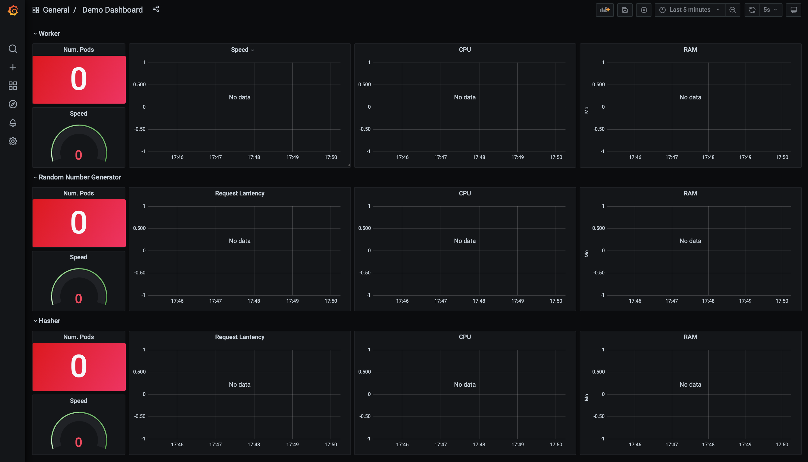
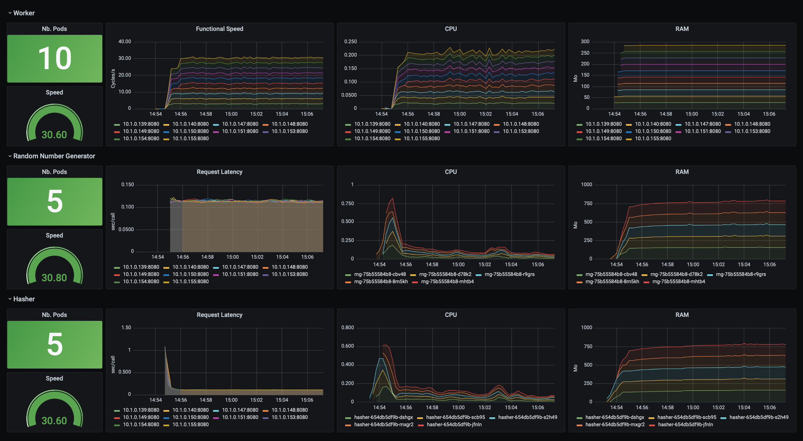
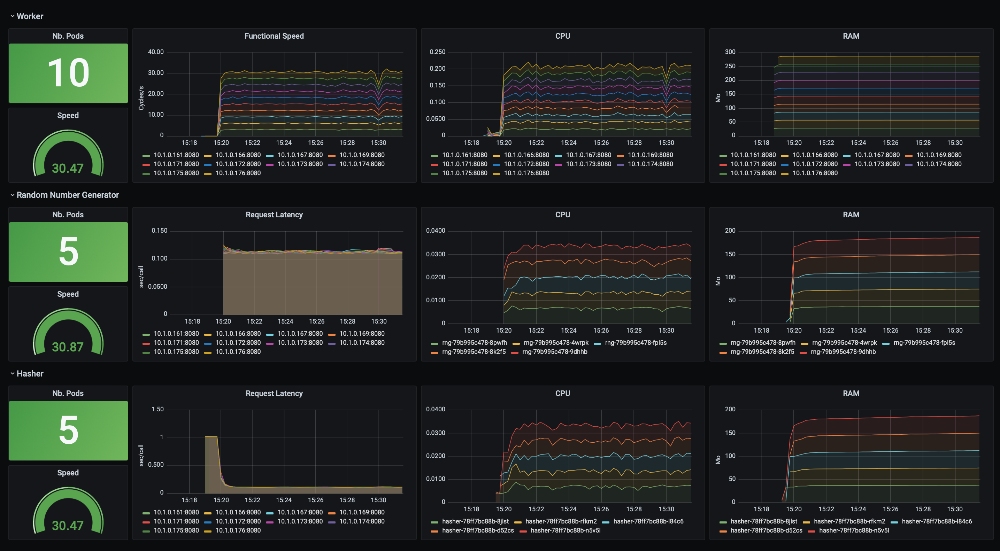

# JVM vs Native - Configuration des conteneurs Java dans Kubernetes


Dans un article précédent, [JVM vs Native - Une réelle comparaison des performances](https://scalastic.io/jvm-vs-native/), j'avais montré comment installer une stack Kubernetes complète afin de pouvoir mesurer les métriques de microservices Java. La configuration étant longue et fastidieuse (l'article aussi sans doute), je ne m'étais pas attardé sur la configuration des conteneurs.

Dans cet article, nous allons voir pourquoi, dans une application Java, cette configuration est primordiale et en quoi elle impacte les ressources consommées par une application.


## Rappel du contexte

Notre but était de comparer l'exécution d'une application Java, entre ses versions Bytecode (JVM HotSpot) et native (compilation avec GraalVM). Pour cela, nous avons mis en place un cluster local Kubernetes avec Promotheus et Grafana pour, respectivement, récolter et présenter les métriques. Nous avons aussi outillé nos microservices Java avec Micrometer afin d'exposer les métriques de nos applications à Promotheus.

Nous obtenions les résultats suivants dans Grafana :


Et nous constations à propos de :

- **La latence**
  - Aucun changement dans la réactivité des microservices.
 
- **L’utilisation de l’UC**
  - Dans sa version en Bytecode, l’utilisation du CPU a tendance à diminuer avec le temps. Cela est dû à l'action du compilateur HotSpot *C2* qui produit un code natif de plus en plus optimisé avec le temps.
  - En revanche, l’utilisation du processeur dans sa version native est faible dès le départ.
 
- **L’utilisation de la RAM**
  - Étonnamment, ***les applications natives utilisent plus de mémoire que celles en Bytecode*** !


En effet, nous n'avions apporté aucune configuration particulière à nos conteneurs. C'est donc le moment de corriger cela.


## Kubernetes : fonctionnement d'un Pod

> Attention
> Par défaut, lorsque l'on crée un pod, il utilise toutes les ressources système de la machine hôte. C'est dit!

Afin de s'en prémunir, il faut assigner des limites de ressources :
- Soit au niveau du pod,
- Soit au niveau du namespace ce qui impactera, par défaut, les pods qu'il contient.

En réalité, sous le capot, il s'agit des ***cgroup*** du noyau Linux que Docker et tous les Container Runtime Interface prennent en compte pour assigner des ressources.


### Les différents types de ressources dans Kubernetes

Actuellement, elles sont de 3 types :
- CPU
- Mémoire
- Hugepages (depuis Kubernetes v1.14) 

Les ressources de type *CPU* et *Mémoire* sont dites des **ressources de calcul**.
Les *Hugepages* sont des mécanismes d'optimisation de la mémoire virtuelle qui réservent une grande quantité de mémoire plutôt que de multiples fragments ce qui accroit les performances du système.


### Limites soft et hard

Dans le système d'un OS, les limites de ressource sont de 2 types :
- Limite soft : quantité de ressource nécessaire
- Limite hard : quantité maximale autorisée

On retrouve ces deux limites dans Kubernetes pour gérer les ressources des pods:
- **requests** pour la quantité nécessaire
- **limits** pour la quantité maximale

> info
> Si l'on spécifie uniquement limits, Kubernetes affectera automatiquement la même valeur à requests.

### Unité de ressource

La problématique ici est de spécifier une unité commune de CPU ou de mémoire alors que les sytèmes physiques sont hétérogènes.

### Limite du CPU

- Elle est exprimée en terme de coeur de CPU (CPU core). Il s'agit donc de vCPU/Core dans une architecture Cloud et de coeur hypertheadé lorsqu'il s'agit de machine en bare-metal à base d'x86
- Un coeur de processeur pouvant être partagé par plusieurs pods, on spécifie aussi une fraction d'utilisation de ce coeur par pod. On peut l'exprimer en core (0.5 soit la moitié du coeur) ou en millicore (250m soit le quart d'un coeur)
- On ne peut pas aller en dessous de 1m ou 0.001 (implicitement en core)

### Limite de mémoire

- Elle est exprimée soit en **octet** (Byte en anglais), soit en son **équivalent binaire** : 1024 octets = 1000 bi-octets 
- On peut la simplifier avec les suffixes K, M, G, T, P, E ou en binaire Ki, Mi, Gi, Ti, Pi, Ei.

Voici un tableau récapitulatif :

| Nom       | Octets | Suffixe| Nom       | Bi-Octets | Suffixe|
|:---------:|:------:|:------:|:---------:|:---------:|:------:|
| kilooctet |  10^3  |    K   | kibioctet |    2^10   |   Ki   |
| mégaoctet |  10^6  |    M   | mébioctet |    2^20   |   Mi   |
| gigaoctet |  10^9  |    G   | gibioctet |    2^30   |   Gi   |
| téraoctet | 10^12  |    T   | tébioctet |    2^40   |   Ti   |
| pétaoctet | 10^15  |    P   | pétioctet |    2^50   |   Pi   |
| exaoctet  | 10^18  |    E   | exioctet  |    2^60   |   Ei   |

### Fonctionnement des *limits* dans Kubernetes

Kubernetes laisse le soin au *Container Runtime* (par exemple Docker) de gérer les `limits` :
- **Pour le CPU**, par exemple avec Docker, il calcule un quota de seconde qu'un pod est en droit d'utiliser toutes les 100ms. Lorsqu'un pod consomme son quota, Docker le met en attente pour 100ms et passe aux pods suivants. Si le pod consomme moins que son quota, il passe là encore aux pods suivants.
- Cette méthode de répartition du CPU est appelée *Completely Fair Scheduler*.
- **Pour la mémoire**, lorsque `limits` est atteinte, le *container runtime* va supprimer le pod (qui redémarrera ensuite) avec un *Out Of Memory*. 
- A noter aussi, que lorsqu'un pod dépasse sa `requests`, il devient candidat à une éviction si l'hôte manque de ressources mémoire. Il est donc important de ne pas sous-estimer la valeur de `requests`.


## Exemple de configuration des ressources d'un pod

Prenons l'exemple du microservice **hasher-java** et configurons son déploiement.

- Les **requests**, quantité de ressources nécessaires, se configure dans Kubernetes avec `spec.containers[].resources.requests`.
- les **limits**, quantité maximale autorisée, se configure avec `spec.containers[].resources.limits`.

Pour le microservice **hasher-java**, voici ce que cela donne :

```yaml
apiVersion: apps/v1
kind: Deployment
metadata:
  name: hasher
  namespace: demo
  labels:
    app: hasher
spec:
  replicas: 1
  selector:
    matchLabels:
      app: hasher
  strategy:
    type: RollingUpdate
    rollingUpdate:
      maxUnavailable: 1
      maxSurge: 1
  template:
    metadata:
      name: hasher
      labels:
        app: hasher
    spec:
      containers:
        - image: hasher-jvm:1.0.0
          imagePullPolicy: IfNotPresent
          name: hasher
          resources:
            requests:
              memory: "50Mi"
              cpu: "50m"
            limits:
              memory: "256Mi"
              cpu: "200m"
          ports:
            - containerPort: 8080
              name: http-hasher
              protocol: TCP
          readinessProbe:
            failureThreshold: 3
            httpGet:
              path: /actuator/health
              port: 8080
              scheme: HTTP
            initialDelaySeconds: 10
            periodSeconds: 30
            successThreshold: 1
            timeoutSeconds: 2
```


D'accord, alors on est bon maintenant ?

Pas sûr, il reste encore des éléments à vérifier côté Java... Voyons de quoi il s'agit.


## Java dans Kubernetes

La JVM interroge l'OS hôte pour configurer le nombre de threads du Garbage Collector et la mémoire à utiliser. Dans un environnement conteneurisé, les informations de l'OS ne reflètent pas celle du conteneur.

Cette problématique a été traitée en 2017 et est gérée depuis la version **Java 10 b34** ainsi que les versions ultérieures. La correction a aussi été reportée sur le JDK 8 à partir de la version **Java 8u191**. Elle se traduit par l'ajout d'un paramètre `-XX:+UseContainerSupports` qui est activé par défaut dans la JVM et qui lui permet d'extraire les bonnes informations des conteneurs.

D'autres paramètres apparaissent au fil des versions Java afin d'affiner le fonctionnement dans les conteneurs: **-XX:ActiveProcessorCount**, **-XX:PreferContainerQuotaForCPUCount**, **-XX:MaxRAMPercentage**.

Mais si vous utilisez des versions du JDK intégrant **UseContainerSupports**, tout devrait bien se passer.


## Démonstration

Voyons ce que cette nouvelle configuration apporte à nos microservices.

### Création de l'environnement Kubernetes

Repartons d'un environnement Kube qui contient toutes les composants nécessaires à notre démo :

- Un cluster k8s (local)
- Metrics Server
- Promotheus
- Grafana

Pour cela, placez-vous à la racine du dépôt git que vous avez cloné puis lancez les commandes suivantes :


kubectl apply -f ./k8s/


Cela peut prendre quelques minutes avant que tous les composants soient fonctionnels.
Celui qui nous intéresse en premier lieu est Grafana.

### Dashboard Grafana

- Connectez-vous à l'interface de Grafana : <http://localhost:3000/>

  Le login / mot de passe par défaut est **admin** / **admin**.

- Importez le dashboard qui se trouve dans le dépôt git sous `./grafana/dashboard.json`.

  1. Pour cela, allez dans le menu **Dashboards** / **Manage** puis cliquez sur le bouton **Import**.
  1. Cliquez ensuite sur **Upload JSON file** et sélectionnez le fichier **./grafana/dashboard.json**.
  1. Dans le champ **prometheus**, sélectionnez la Data Source qui a été créée avec les composants Kube et qui s'appelle **prometheus**.
  1. Cliquez sur **Import**.

Vous devriez voir le dashboard de notre démo :




### Lancement de l'application démo et ses microservices en Bytecode

Nous allons démarrer l'application compilée en Bytecode avec 10 **worker**s, 5 **hasher**s et 5 **rng**s :
```bash
kubectl apply -f ./app/demo-jvm.yaml
```

Laissons un peu de temps à l'application pour remonter les images Docker et se stabiliser. Vous devriez observer au bout de quelques minutes :



#### Qu'observe-t-on ?

- Pour le CPU
  - Un pic à 700m lors du déploiement des microservices Java : le compilateur C1/C2 qui se met en route.
  - On constate ensuite une diminution progressive de la consomation CPU passant de 200m à 100m : le résultat de l'optimisation du code natif produit par le compilateur C2.
- Pour le RAM
  - Elle monte rapidement à 750Mo pour se stabiliser à cette valeur.

### Suppression de l'application

Supprimons l'application en lançant la commande suivante :

```bash
kubectl delete -f ./app/demo-jvm.yaml
```

A présent, voyons comment se déroule le déploiement de la version compilée en code natif.

### Lancement de l'application démo et ses microservices en natif

Procédons comme auparavant et lançons la version native de l'application :

```bash
kubectl apply -f ./app/demo-native.yaml
```

Laissons-lui quelques minutes afin d'observer son comportement dans le temps :



#### Que constate-t-on ?

- Pour le CPU
  - Aucun pic de consommation au démarrage mais tout de suite une consommation qui se stabilise à 35m : en effet, le code natif a déjà été compilé et optimisé.
- Pour le RAM
  - Elle augmente légèrement mais reste en dessous des 200Mo.


## Conclusion

- On constate, dans un environnement contraint, que le code natif de notre application Spring Boot, produit par GraalVM, consomme 3x moins de CPU que la même application compilée en Bytecode.
- En ce qui concerne la mémoire, on constate aussi une diminution d'un facteur 4 pour l'application Spring Boot en code natif.

1. Cela diffère complètement de ce que nous avions observé dans nos tests, sans contrainte CPU et mémoire sur les pods. On voit bien alors l'avantage que procure une bonne configuration de ses pods.
1. A noter aussi, dans notre cas, que pour un même cluster Kubernetes (et donc pour le même coût), il sera possible d'exécuter 3x plus de microservices avec une application Spring Boot, compilée en code natif avec GraalVM.

L'arrivée de GraalVM marque donc bien un changement profond dans l'écosystème Java. Les équipes de Spring, en migrant vers GraalVM, vont permettre à nos applications legacy de profiter pleinement des environnements contraints comme le Cloud. Et tout cela, en maitrisant les coûts.

Autre remarque importante, ces tests ont été effectués avec une version non encore optimisée de Spring Native, la version **0.10.0-SNAPSHOT**. C'est en effet dans la prochaine itération, la **0.11.0**, que les équipes de Spring vont optimiser la consommation des ressources. Nul doute que cela est d'ores et déjà très prometteur.

Cheers...

